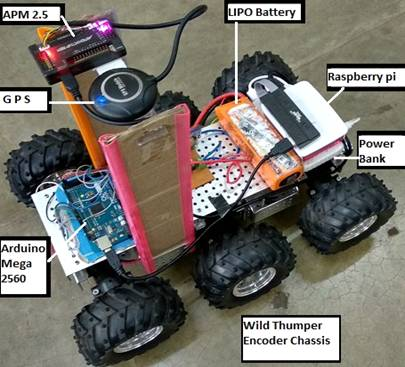
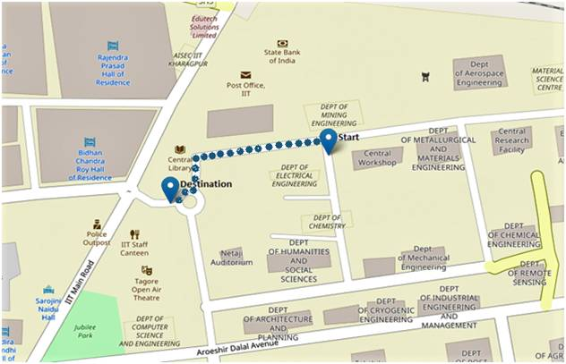

# Autonomous-ATV-IIT-Kharagpur
Autonomous Ground Vehicle Laboratory(AGV lab) , IIT Kharagpur

Keywords: ROS,Autonomous-vehicles,3D-mapping

This project was done during the summer of 2017 at AGV lab, IIT Kharagpur under the guidance of Dr. Debashish Chakraborty. The main aim of the project was to lay the ground work for developing an autonomous mine surveyor. ROs was used with Ubuntu 16.04 as master while raspbian was used on raspberry pi and ROS slave. Using roskinetic api with added features of rosbridge to google map API and mavros link to Arducopter's database , an autonomous all terrain vehicle was made. The Arducopter APM2.8 was used as a sensor hub as it incorporates IMU, GPS, Barometer data all together so that we do not require interfacing all the sensors individually.A successful attempt to make a 3D plot using a LiDar using that could be used as a light insensitive obstacle detector.

Hardware Used :
Raspberry 3 (Raspbian OS)
ATMEGA2560
APM2.8
Methane and CO2 sensors

The above image shows our setup of the ATV designed. A kinect was later on added to the setup for visual data and point clouds.

GUI of OSM Application for Start and Destination points showing the current and intended positions respectively.  (The dotted line represents the path followed by robot)

.jpg)

rqt graph of all active nodes and topics for executing the robot movements in this study

3D scatter plotting of distant obstacles.

Methane and CO2 sensors were used for detection of harmful gas while moving through the mine and mark that part of the mine map as danger. This ATV has only been tested on roads for waypoint navigation using google roads api. The future work of this project would be to integrate it with an appropriate method of slam so that it can render the complete mine while traversing through it. 
